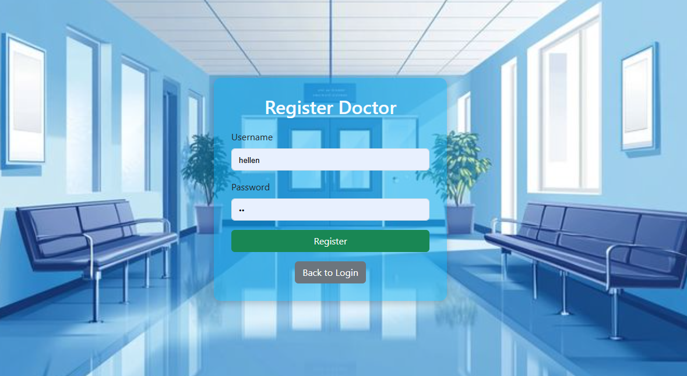
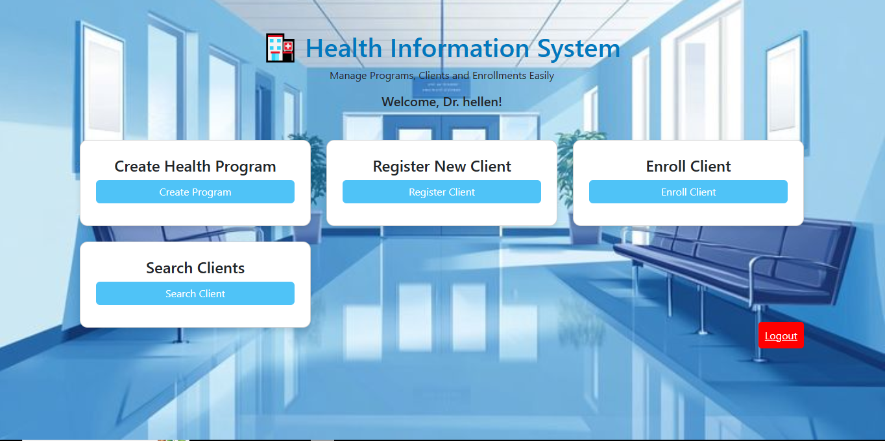

# Health Program management

This is a simple Health Information System built using Flask. It allows doctors to manage health programs, clients, and enrollments.

## Prerequisites

- Python 3.x
- pip (Python package installer)





## Installation

1. **Clone the repository** (or download the project files):
   ```bash
   git clone (https://github.com/joehack1/health_program_management)
   cd health-program-management
   ```

2. **Install the required Python packages**:
   ```bash
   pip install -r requirements.txt
   ```

   * If you don't have a `requirements.txt` file, you can install Flask manually using:
   ```bash
   pip install flask
   ```

3. **Set up the database**:
   * The app uses SQLite, and the necessary database tables will be created automatically when the app is run for the first time.

## Running the Application

1. **Run the Flask application**:
   ```bash
   python app.py
   ```

2. **Open your browser** and go to the following URL:
   ```
   http://127.0.0.1:5000/login
   ```

   * This will load the homepage of the application. If you're not logged in, you will be redirected to the **login page**.

## Login Screen

* The **login screen** allows you to enter your username and password.
* After successful login, you will be redirected to the home page where you can manage health programs, clients, and enrollments.
* If the login credentials are incorrect, you will see an error message prompting you to try again.

## Application Structure

* **app.py**: The main Python file where the Flask app is run and routes are defined.
* **templates/**: Contains HTML files for the app's pages (e.g., login, home, create program, etc.).
* **static/**: Contains static files like images and stylesheets.

## Notes

* The app uses SQLite as the database.
* The login credentials are stored in the SQLite database, and the default table is `doctors` with columns `id`, `username`, and `password`.
## API Overview

This application uses Flask to manage health programs, client registration, and enrollment.  
The main routes (`endpoints`) are:

- `/login` - Doctor login page.
- `/logout` - Logout and end session.
- `/program/create` - Create a new health program.
- `/client/register` - Register a new client.
- `/enroll` - Enroll a client into one or more programs.
- `/client/search` - Search for registered clients.
- `/client/<client_id>` - View a client's profile and enrolled programs.
- `/register_doctor` - Register a new doctor account.

All routes require login (session) except for `/login` and `/register_doctor`.

The app uses **SQLite** as the database to store doctors, clients, programs, and enrollments.


## License

This project is open-source and available under the MIT License.
